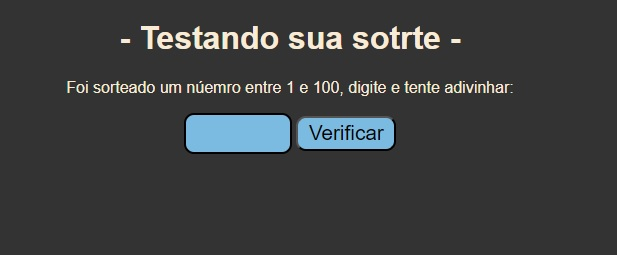
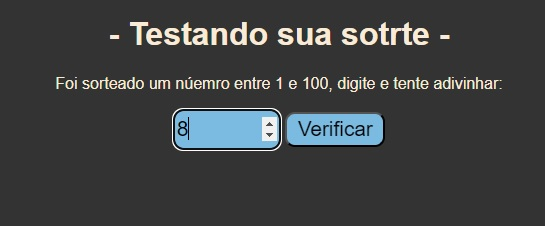
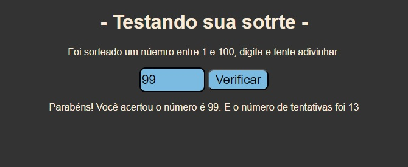

# Estrutura do projeto

### AcimaouAbaixo.html

Aqui nós temos a estrutura que apresenta o jogo na tela para o usuário!

### numAle.js

Aqui foi criada a lógica para que o jogo pudesse ser jogado!

### README.md 

Aqui nesse arquivo temos as instruções, os integrantes e as funcionalidades.


## Funcionalidades

- Como funcionalidade temos a criação de um número aleatório em uma constante chamada de `numAleatorioLaco` dentro do `<script>` no arquivo `AcimaouAbaixo.html`

```
const numAleatorioLaco = Math.floor(Math.random() * 100) + 1;

```
- No jogo tem uma função denominada `numAleatorio` na qual ela irá realizar a comparação entre o número digitado pelo usuário que recebe o nome de `tentativa`, após a comparação exibirá uma mensagem na tela.

```
function numAleatorio() {
            const tentativa = parseInt(document.getElementById('adivinha').value);
            const exibirResultado = document.getElementById('resultado');
        
        
            if (tentativa > numAleatorioLaco) {
                exibirResultado.textContent = 'O número é mais alto sorteado.';
                tentativas++
        
            } else if (tentativa < numAleatorioLaco) {
                exibirResultado.textContent = 'O número é mais baixo sorteado.';
                tentativas++
        
            } else {
                exibirResultado.textContent = `Parabéns! Você acertou o número é ${numAleatorioLaco}. E o número de tentativas foi ${tentativas}`;
                laco = false
            }
        }
```

## Como jogar?
Abaixo temos o passo a passo para demonstração:

## Passo 1:
Acesse o site: [Acesse aqui o site do jogo da Sorte](www.blablalalala.com.br)

## Passo 2:
- Tela inicial



## Passo 3:

- Digite um valor aleatório entre 1 e 100 e clique em verificar, e repita o processo até acertar.



## Passo 4:

- Parabéns acertou e já fica sabendo a quantidade de tentativas.



# Integrantes:

- Marcelo de Carli Rocha - [Linkedin](https://www.linkedin.com/in/marcelo-de-carli-rocha-6714a2b1/)
                        
- Maurício Steffen Vieira

